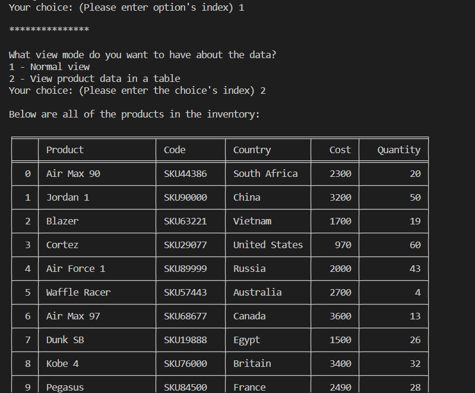

# Inventory

Inventory is a Python program that was made for dealing with inventory management. Managers can use this program to search the product by its code, determine the product with the lowest quantity and restock it, determine the product with the highest quantity, calculate the total value of each stock item.

## Installation <a name="installation"/>

Install [Visual Studio Code](https://code.visualstudio.com/) and [Python](https://www.python.org/downloads/), then clone the repository to start using the program.

```bash
git clone https://github.com/AndrewThien/Inventory.git
```

## Table of Contents
### 1. [Installation](#installation)
### 2. [Usage](#usage)
### 3. [Contributing](#contributing)
### 4. [Credits](#credits)


## Usage <a name="usage"/>

Run the program and you will see a menu as below


Choose an option as desired and follow the prompted instructions to achieve the outcomes. For example, if you want to see all the data about products, choose 1 in the main menu and if you want to see the date in a table, choose 2. The outcome will appear nicely as below.




### Note: 
The program will read the data from the file named 'inventory.txt' and the format of the product data has to be the same with the format in the example file inventory.txt in the repo.

## Contributing <a name="contributing"/>

Pull requests are welcome. For major changes, please open an issue first to discuss what you would like to change.

## Credits <a name="credits"/>

[Tri Thien Nguyen](https://www.linkedin.com/in/tri-thien-nguyen/)
